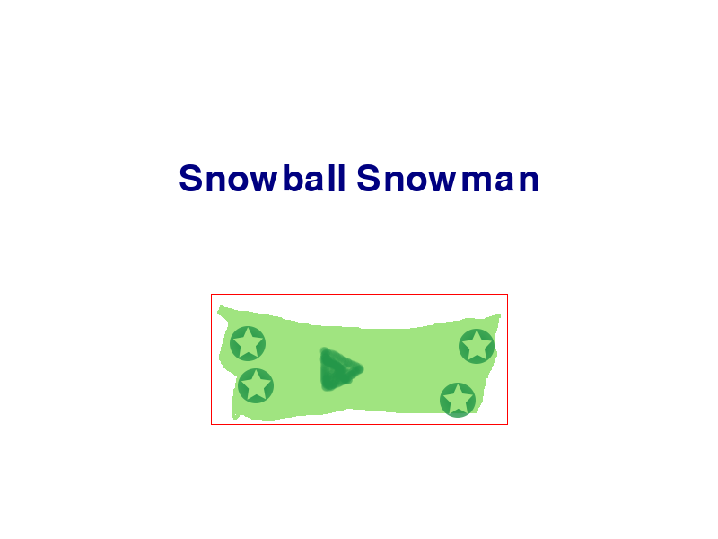
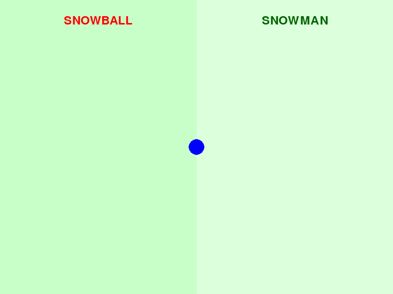

# Snowball Snowman

A delightful Python game where you build a snowman by rolling and stacking snowballs, with a celebratory animation when completed!

## Running the Game

### Normal Mode
```bash
python src/main.py
```
Play the game normally with keyboard controls:
- Arrow keys to move
- Space to roll/place snowballs

### Agent/Test Mode
```bash
python src/main.py --agent
```
Runs the game in automated testing mode:
- Auto-closes after 5 seconds
- Takes screenshots automatically
- Useful for development and testing

## Current Progress Screenshots

### Menu Screen

*The main menu with title and play button*

### Game Screen

*The game screen showing the rolling and building zones*

## Current Status

The game is currently in early development with the following components implemented:
- ✅ Basic game window setup using Pygame
- ✅ Initial test framework with pytest
- ✅ Project structure and documentation
- ✅ Game states (Menu, Playing, Celebration)
- ✅ Snowball rolling mechanics
- ✅ Snowball stacking system
- ✅ Visual feedback for stacking
- ✅ Automated testing with `--agent` mode

### In Progress
- [ ] Decorations (carrot nose, coal eyes)
- [ ] Celebration animation
- [ ] Sound effects
- [ ] Background music

## Roadmap

### Phase 1: Core Mechanics (In Progress)
- [x] Basic window setup
- [x] Game state management
- [ ] Snowball rolling mechanics
- [ ] Snow accumulation system
- [ ] Snowball size tracking
- [ ] Collision detection

### Phase 2: Building Mechanics
- [ ] Snowball stacking system
- [ ] Size requirements for valid stacking
- [ ] Physics-based placement
- [ ] Building area boundaries

### Phase 3: Celebration Animation
- [ ] Carrot nose placement animation
- [ ] Hat placement animation
- [ ] Stick arms animation
- [ ] Particle effects
- [ ] Celebration sound effects

### Phase 4: Polish
- [ ] Menu system
- [ ] Tutorial/instructions
- [ ] Sound effects
- [ ] Background music
- [ ] High score system
- [ ] Multiple difficulty levels

## Lessons Learned

### Development Environment
- Python 3.11 provides the best compatibility for our game development needs
- Virtual environments are crucial for consistent development across machines
- pkg-config is required for Mac users to properly install Pygame

### Testing
- Pytest provides a robust framework for game testing
- Mocking Pygame Zero objects is essential for display testing
- Test-driven development helps catch issues early
- Writing tests first helps clarify feature requirements

### Game Architecture
- Separating game states (Menu, Playing, Celebration) improves code organization
- Using Pygame Zero simplifies window management and game loop
- Keeping the main game loop clean improves maintainability
- Clear separation of concerns between game logic and rendering

### UI/UX Design
- 800x600 window size provides good gameplay area
- Simple menu system helps with game flow
- Visual feedback is important for user interaction
- Consistent visual style improves game feel

## Getting Started

### Prerequisites
- Python 3.11 (recommended)
- pip (Python package manager)
- pkg-config (for Mac users)

### Installation
1. Clone the repository
2. Create a virtual environment:
   ```bash
   python -m venv venv
   source venv/bin/activate  # On Windows: venv\Scripts\activate
   ```
3. Install dependencies:
   ```bash
   pip install -r requirements.txt
   ```

### Running the Game
```bash
python src/main.py
```

### Running Tests
```bash
python -m pytest
```

## Contributing
See [CONTRIBUTING.md](CONTRIBUTING.md) for detailed contribution guidelines.

## License
This project is licensed under the MIT License - see the [LICENSE](LICENSE) file for details. 
