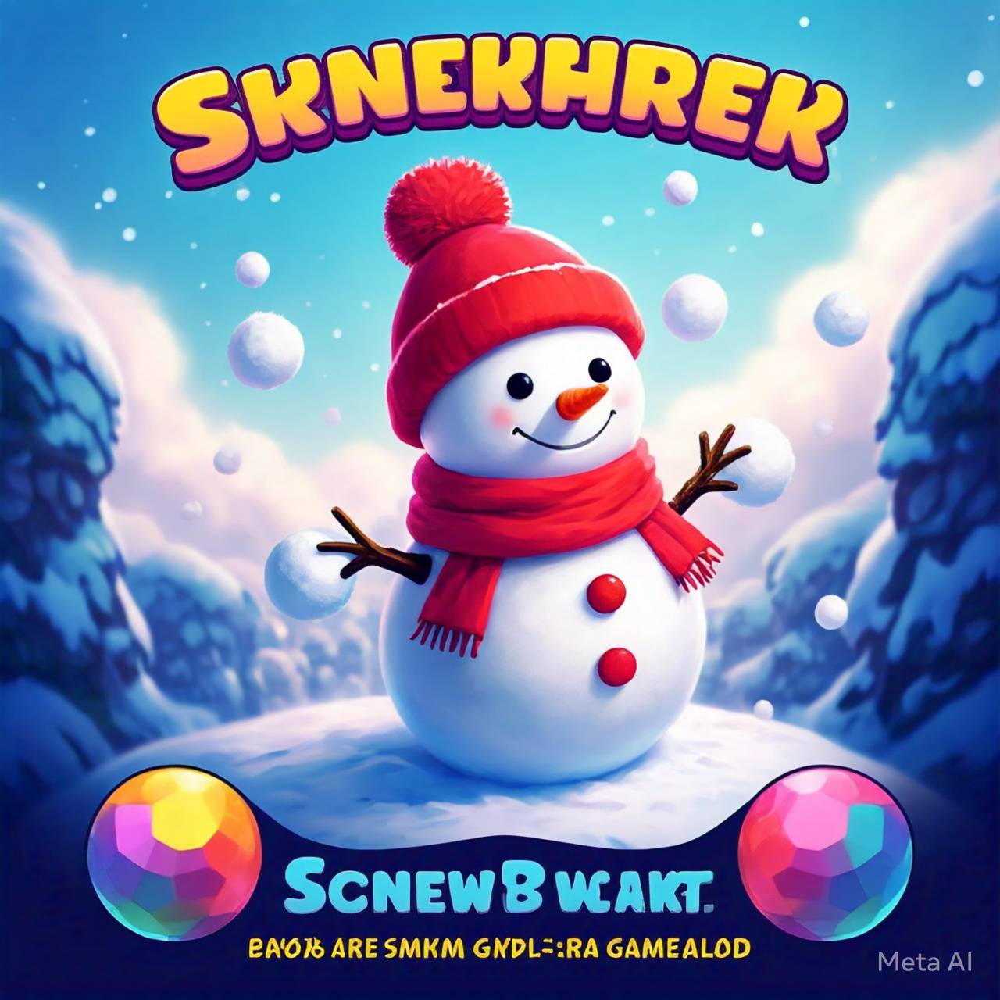

# Snowball Snowman

A creative puzzle game about the art and science of snowman building! Shape, craft, and race against nature's elements to build the perfect snowman.

## Inspiration

*Our inspiration for the snow shaping and building mechanics*

## Game Overview

In Snowball Snowman, players become master snow sculptors in a winter wonderland where temperature and time are your greatest challenges:

### Core Mechanics
- **Snow Collection:** Gather snow from the ground into your workspace
- **Shaping Process:**
  1. Form snow into square blocks
  2. Carefully trim edges to create perfect circles
  3. Stack and position snowballs to build your snowman
- **Temperature System:**
  - Different temperatures affect snow behavior
  - Warmer temps make snow melt faster but stick better
  - Colder temps preserve snow longer but make it harder to shape
  - Watch the thermometer for changing conditions!
- **Celebration Animation:**
  - When you complete a snowman, watch it come to life!
  - Carrot nose magically appears
  - Hat floats down from above
  - Stick arms pop out from the sides
  - Your snowman does a happy wiggle dance!

### Game Modes
1. **Story Mode:**
  - Progress through increasingly challenging levels
  - Unlock new temperature mechanics
  - Learn advanced snowman-building techniques
  - Face different weather conditions

2. **Challenge Mode:**
  - Race against the melting clock
  - Temperature changes mid-level
  - Special shapes and decorations required
  - Precision scoring system

3. **Sandbox Mode:**
  - Experiment with different temperatures
  - Practice shaping techniques
  - No time pressure
  - Create custom snowmen

## Art Creation Guide

### Tools for Creating Game Art
1. **Kid-Friendly Art Tools:**
   - [Piskel](https://www.piskelapp.com/) - Free online sprite editor, great for pixel art
   - [Krita](https://krita.org/) - Free drawing program with simple tools
   - [Paint.NET](https://www.getpaint.net/) - Easy to use image editor
   - Regular paper and pencils/markers for drawing, then scanning or photographing

### Recommended Art Assets to Create
1. **Snow Elements:**
   - Snow piles of various sizes
   - Square-shaped snow blocks
   - Circle-cutting guides
   - Perfect snowballs
   - Melting snow animations
   - Snowman wiggle dance animation

2. **Environment:**
   - Thermometer display
   - Weather effects
   - Background scenes for different temperatures
   - Ice crystals and water droplets

3. **UI Elements:**
   - Temperature gauge
   - Melting timer
   - Shaping tools
   - Level indicators
   - Menu buttons

4. **Decorative Items & Animations:**
   - Carrot nose (with magical appearance effect)
   - Coal/button eyes (with twinkling effect)
   - Stick arms (with pop-out animation)
   - Hats (with floating descent animation)
   - Scarves (with wrapping animation)
   - Special unlockable decorations
   - Celebration particle effects (sparkles, snowflakes)

### Art Guidelines
- Keep designs simple and clear
- Use PNG format for transparency
- Make sprites at least 64x64 pixels for good visibility
- Use bright, contrasting colors
- Create variations for different temperature states

## Technical Details

### Requirements
- Python 3.8+
- Pygame
- Other dependencies will be listed in requirements.txt

### Project Structure
```
snowball_snowman/
├── src/
│   ├── game/
│   │   ├── __init__.py
│   │   ├── snow.py          # Snow physics and behavior
│   │   ├── temperature.py   # Temperature system
│   │   ├── shaping.py      # Snow shaping mechanics
│   │   └── level.py        # Level management
│   ├── graphics/
│   │   ├── __init__.py
│   │   └── sprites.py
│   └── utils/
│       ├── __init__.py
│       └── physics.py
├── assets/
│   ├── images/
│   │   ├── snow/           # Snow textures and shapes
│   │   ├── tools/          # Shaping tools
│   │   ├── environment/    # Weather and backgrounds
│   │   └── ui/            # Interface elements
│   ├── sounds/
│   └── music/
├── tests/
└── docs/
```

## Features Roadmap

- [ ] Basic snow gathering and shaping
- [ ] Temperature system implementation
- [ ] Snow physics (melting, sticking)
- [ ] Shape-cutting mechanics
- [ ] Level progression system
- [ ] Temperature-based challenges
- [ ] Decorative items and scoring
- [ ] Tutorial system
- [ ] Sound effects and music
- [ ] Menu and UI
- [ ] Touch controls for mobile
- [ ] Android APK packaging

## Development Status

🚧 Currently in initial development phase

## Getting Started

```bash
# Create and activate virtual environment
python -m venv venv
source venv/bin/activate  # On Windows use: venv\Scripts\activate

# Install dependencies
pip install -r requirements.txt

# Run the game
python src/main.py
```

## License

This project is licensed under the MIT License - see the [LICENSE](LICENSE) file for details. 
